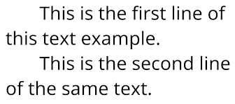
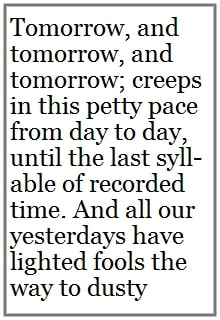
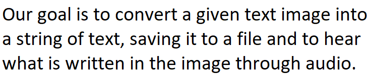

# Python | Convert image to text and then to speech

`Our goal is to convert a given text image into a string of text, saving it to a file and to hear what is written in the image through audio.`

## Objective
Objective is the development of an interface to textual information for the visually impaired that uses video, image processing, optical-character-recognition (OCR) and text-to-speech (TTS). The video provides a sequence of low resolution images in which text must be detected, rectified and converted into high resolution rectangular blocks that are capable of being analyzed via off-the-shelf OCR. To achieve this, various problems related to feature detection, mosaicing, binarization, and systems integration were solved in the development of the system.

For getting the image sequences, frames are cut at regular interval from the video, then pre-processes that image to get a clearer image. After that, using image stiching tool of `OpenCV Python`, a single image of the whole text is generated. Thereafter, that image is given to the `OCR (Tesseract)`, which further give it’s output to the `Google Text To Speech engine (gTTS)` to make a final audio speech output.
## Technologies Used
1. **Pytesseract(Python-tesseract) :** It is an optical character recognition (OCR) tool for python sponsored by google.
2. **pyttsx3 :** It is an offline cross-platform Text-to-Speech library
3. **Python Imaging Library (PIL) :** It adds image processing capabilities to your Python interpreter
4. **Googletrans :** It is a free python library that implements the Google Translate API.
## I. File List
* main.py Main python code that implements the features
* file.txt for Image converted into Text
* speech.mp3 is audio file
## II. Dependencies
* [python](https://docs.python.org/2/install/)
* [pip](https://pip.pypa.io/en/stable/installing/)
* [OpenCV](http://goo.gl/lGieGN)
* [Pyttesseract](https://pypi.python.org/pypi/pytesseract)
* [gTTS](https://pypi.python.org/pypi/gTTS)
* [Pillow](https://pypi.python.org/pypi/Pillow/2.2.1)

* Install os package : `pip install os`
## Examples

https://user-images.githubusercontent.com/58298647/167299234-0edb71b2-ae2c-4c63-bfd0-433e92147b66.mp4

----------------------------------------------------------------------------

https://user-images.githubusercontent.com/58298647/167299239-785ef458-182b-4d14-9c79-91dab2021e28.mp4

----------------------------------------------------------------------------

https://user-images.githubusercontent.com/58298647/167299247-491fab2c-a824-4027-8a13-2af937d1396f.mp4

----------------------------------------------------------------------------

https://user-images.githubusercontent.com/58298647/167299256-6ed8277c-2563-477e-9384-3265158f03d1.mp4

----------------------------------------------------------------------------
